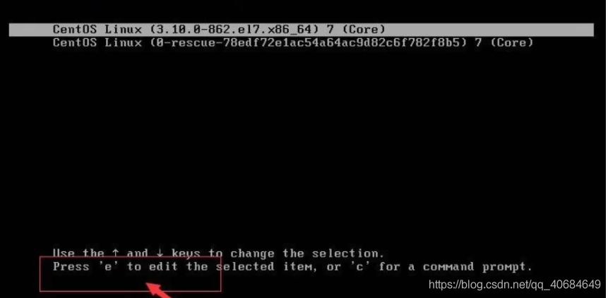
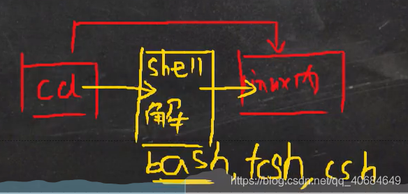
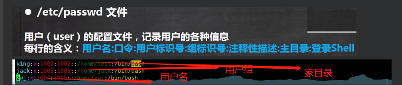
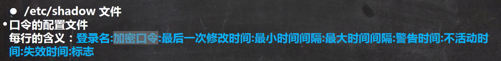
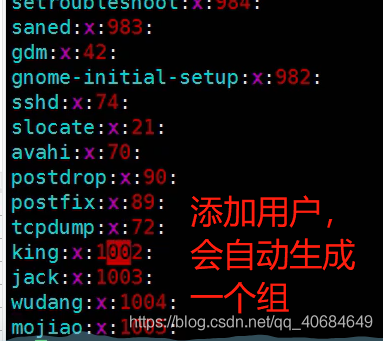

### 一、Linux目录文件

##### 基本目录结构

- liunx里一切皆为文件；

##### 详细的目录

- /bin 经常使用的命令

- /sbin 存放的是系统管理员使用的系统管理程序

- /home 存放普通用户的主目录

- ```liunx
  useradd Jack ----- 添加用户Jack
  userdel -r jack 删除Jack用户
  ```

- /root 系统管理员 ， 也称作超级权限者的用户主目录

- /lib 系统开机所需要最基本的动态链接共享库

- / lost + found 这个目录一般情况下是空的，当系统非法关机后，这里就存放了一些文件

- /etc 所有系统管理所需要的配置文件和子目录。比如安装mysql数据库。my.conf

- /usr 用户的很多应用文件都存放在这个目录

- /boot 存放的是启动linux时使用的一些核心文件，包括连接文件和镜像文件；

- /proc 虚拟的目录，系统内存的映射

- /srv 服务启动之后，需要提取数据

- / sys 该目录下安装2.6内核中新出现的一个文件系统

- /tmp 存放临时文件

- /dev  类似于Windows的设备管理器，把所有硬件用文件的形式存储

- /media linux 自动识别一些设备。例如： U盘、光驱。liunx把识别的设备挂载到这个目录下。

- /mnt 临时挂载在别的文件系统，例如：主句和虚拟机的文件共享。VMtools是一个很好的例子。

- /opt 主机额外安装软件所存放的目录

- /usr/local 这是另一个给主机额外软件安装的目录

- /var 存放不断扩充这的东西，例子： 日志

- /selinux 是一种安全子系统 ， 例子： 360


### 二、远程登录liunx

1、多人上传或者下载linux文件

- ifconfig ------ 查看ip
- shell 连接
- xftp6连接
- 乱码解决-------- reboot 重启


### 三、实操篇

#### vi和vim编辑器

1. linux系统会内置vi文本编辑器
2. vim具有程序编辑能力，可以看做是vi的增强版本， 可以主动以字体演的辨别语法的正确性，方便程序设计，代码补全， 编译及错误跳转等方便编辑功能特别丰富；

#####  vi和vim常用的三种模式

- 正常模式

- 插入模式

- 命令行模式：输入esc再输入：在这个模式当中， 可以提供你相关指令，完成读取，存盘，替换，离开vim，显示行号等的动作则是在此模式中达成的！

- 例子：

  ```linux
  1.vim Hello.java 创建文件输入内容
  2.输入esc
  3.输入:eq 保存并且退出
  ```

##### 各种模式的相互切换




#### 关机、重启命令

```linux
shutdown -h now    立刻关机
shutdown -h 1      一分钟之后关机
shutdown -r now    现在重新启动计算机
halt               关机、作用和上面一样
reboot             重新启动计算机
sync               把内存的数据同步到磁盘

注意：
1、 不管是系统关闭还是重启， 首先要运行sync命令， 把内存中的数据写到磁盘上；
2、 目前的shutdown/reboor/halt等命令已经砸关机前执行了sync
```


#### 用户登录和注销

```
1、登录时，尽量使用普通用户登录，避免操作失误。 登录后， 可以利用su -用户名 命令来切换成系统管理员身份
2、在提示符下输入logout即可注销用户


```


#### 用户管理

```linux
基本介绍
Linux系统是一个用户多任务的操作系统，任何一个要使用系统资源的用户，都必须首先向管理用申请一个账号，然后以这个账号的身份进入系统。

添加用户
- useradd 用户名
- 添加一个mail用户， 默认在该用户的家目录在/home/mail useradd -d /honme/test king 指定把king用户生成的用户文件信息存放在text中

指定/修改密码
基本语法
passwd 用户名
pwd 命令显示当前用户所在的目录
注意： 如果passwd没有输入用户名， 那么就是修改的是当前登录用户的密码

删除用户
基本语法
userdel 用户名
1、删除用户mailan，但是要保留目录。 userdel mainan
2、删除用户tom， 不保留家目录。 userdel -r tom
注意： 删除用户，建议保留家目录

查询用户信息指令
基本用法
id 用户名
注意： 当用户不存在时， 返回无此用户。


切换用户
基本语法 su - 用户名
注意： 
1、权限高的用户切换权限低的用户，不需要密码。反之需要
2、当需要返回原来的用户时， 使用exit/logout指令。

查看当前用户/登录用户
基本语法： who am i
```


#### 用户组

```linux
类似角色，系统可以对共性、权限的多个用户进行统一管理
新增组： groupadd 组名
删除组： groupadd 组名
注意： 添加一个用户时。他会自动生成组

增加用户时，直接加上组：useradd -g用户组 用户名

修改用户的组： usermod -g 用户组 用户名
```


#### Shell 和 Linux指令传输图











#### 运行级别

```linux
运行级别说明：
0：关机
1： 单用户
2： 多用户状态没有网络服务
3： 多用户状态有网络服务
4： 系统未使用保留给用户
5： 图形系统界面
6： 系统重启
常用运行级别是3和5， 也可以指定默认运行级别
命令： init【0123456】应用案例：通过init来切换不同的运行级别
```

在centos7以前， /etc/inittab文件中，进行了简化，如下：

multi-user.target: analogous to runlevel3 命令窗口

graphical.target: analogous to runlevel 5 图形化

/# To view current default target ,run:

systemctl get-default 查看当前是命令窗口还是图形化

/# To set a default target,  run

systemctl set-default TARGET.target  设置/切换


注意： 工作中用3，学习用5


#### 找回root密码

1. 首先，启动系统，进入开机界面，在界面中按e进入编辑界面
2. 进入编辑界面，使用键盘的上下键把光标往下移动，找到Linux16,开头内容所在的行数，在行的最后输入： init=/bin/sh
3. 接着，输入完后，直接快捷键： Ctrl + x 进入单用户模式
4. 接着，在光标闪烁的位置，输入： mount -o remount，rw /(注意： 各个单词有空格)， 完成后按键盘的快捷键（Enter）
5. 在新的 一行最后输入： passwd， 完成后按键盘的回车键（enter） 输入密码，然后再次确认密码即可（提示： 密码长度最好是8为以上，但不是必须的） ， 密码修改后，会显示passwd。。。 样式 ， 说明密码修改成功。
6. 接着，在鼠标闪烁的位置中（最后一行） 输入： touch/ .autorelabe (注意： touch/ 后面有个空格)， 完成后键盘的回车键（enter）
7. 继续在光标闪烁的位置中输入： exec /sbin/init， 完成后键盘回车，等待系统自动修改密码，完成后，系统会自动重启，新的密码生效了


#### 帮助指令

```linux
man获得帮助指令
基本用法： man[命令或配置文件] （功能描述： 或得帮助信息）
例子： 查看ls 命令的版主信息 man ls
注意： 输入 man ls 后，输入空格，下一页 ，输入q，回退到开始的地方。
ls 查看当前文件
ls -a 查看当前文件（包含隐藏文件）
ls -l 单行查看当前文件
ls -la 单行查看当前文件（包含隐藏文件）  
ls -al /root 查看指定的目录，以单行查看当前文件（包含隐藏文件）
ls -al /home 查看指定的目录，以单行查看当前文件（包含隐藏文件）

```


#### 文件目录类


