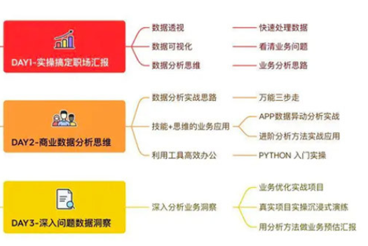

1、Python编程

- [ ] 集合数据类型 Collection
- [ ] 函数和lambda函数

2、处理数据----（数据清洗pandas库）

- [ ] 创建、读取和写入数据
- [ ] 选择和分配
- [ ] 处理缺失数据
- [ ] 合并来自不同来源的数据
- [ ] 摘要、交叉表和数据透视功能

数据集的选择可以从易到难，从小到大。直到把所有的pands基础功能都达到非常熟悉的程度

3、使用数组----（Numpy有助于提高计算速度并有效利用内存）

- [ ] 创建1/2/3维数组
- [ ] 索引、切片、连接和拆分
- [ ] 迭代和操作
- [ ] 排序、搜索和过滤
- [ ] 数学和统计运算

4、数据可视化

- [ ] Matplotlib——高度可定制的（matplotlib 官方教程[：https://www.matplotlib.org.cn](https://link.zhihu.com/?target=https%3A//www.matplotlib.org.cn/)/）
- [ ] Seaborn — 不是可定制的，但构建视觉效果非常简单快捷，是数据分析的好选择（Seaborn 官方教程[：https://seaborn.apachecn.org/#](https://link.zhihu.com/?target=https%3A//seaborn.apachecn.org/%23/)/）
- [ ] Excel可视化

5、统计学（**描述性统计**有助于更好地理解数据并对其进行总结以便于理解。）

- [ ] **描述性和推论性统计概念**
- [ ] 数据分布类型
- [ ] 中心极限定理和误差范围
- [ ] 置信区间和置信水平
- [ ] 因果关系
- [ ] 统计检验

6、SQL（SQL 是数据科学从业者所需的最重要技能之一）

- [ ] 选择分布在不同表中的数据
- [ ] 过滤所需的数据集
- [ ] 将数据聚合到所需的粒度
- [ ] 使用Rank()和Row_Num() 从特定序列中选择记录
- [ ] 将复杂查询分解为子查询

7、学习数据分析和特征工程（在处理预测问题时，特征工程有助于提高准确性。）

