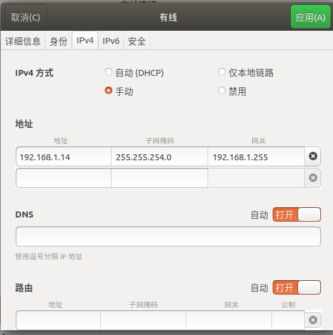

## 人脸检测测试

#### EVB板端测试

1. 首先 准备 维度全覆盖、且均匀分布、且已做清洗的纯净测试数据集；

2. 在linux系统上部署minicom环境，网络配置如下：

   

3. nfs搭建

   注意：

   - 测试数据一定要放在root里面；
   - 配置数据地址 list.txt 要与images data的路径连接起来；
   - list（只是图片名，带后缀）放在images文件夹内。

4. 结果在result里面，有个target_result XXX文件，是txt格式，后续自动化测试报告需要把它转换成csv

5. 利用label（csv）和result（csv），放入自动化测试报告的代码中，可以跑出用例维度的各个召回率和漏检率等值。

6. 利用自动化测试代码，可以拉出并拉框 漏检误检的图片 ，用作分析。

## PC端人脸检测测试及分析流程

1. txt or json 转换成csv label
2. 大模型跑出预测txt转换成csv
2. 根据label扣小图
2. 根据小图跑姿态，得出list
2. 跑图片的模糊度，得出list
3. 放入 evaloution_with_sub_dims.py中运行，得出各个维度的召回率和误检率。以及拉出误检和漏检的图片。